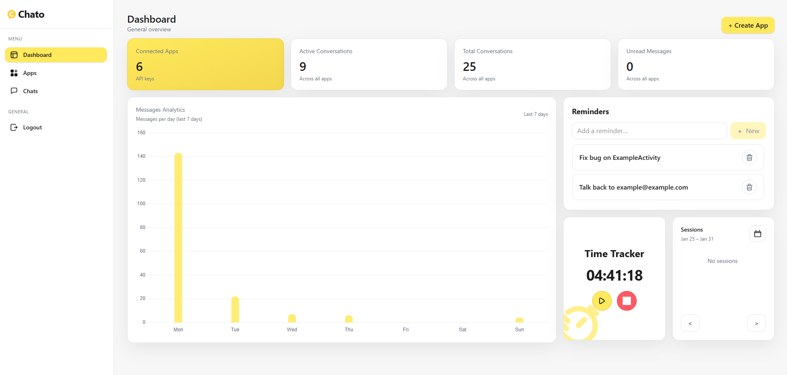
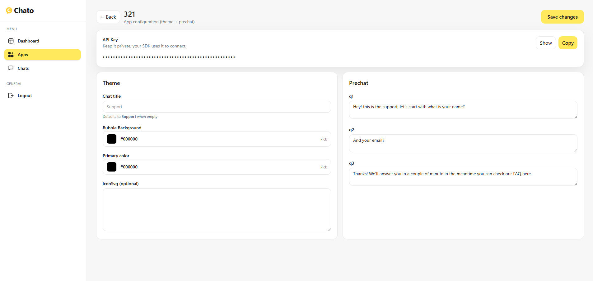
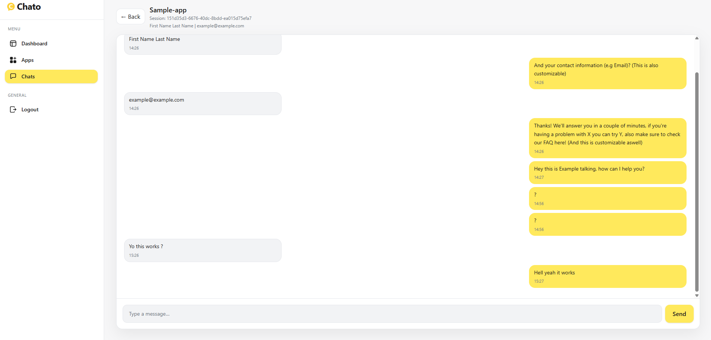

# Chato Dashboard

Chato Dashboard is the web interface for managing conversations created by the Chato Android SDK.

It allows app owners to:
- View active customer sessions
- Reply to users in real time
- Configure SDK behavior and UI remotely
- Monitor support activity per application

---

## Chato Frontend Dashboard

🚀 **Live Demo:**  
👉 https://chato-dashboard.onrender.com/dashboard

> This dashboard is fully deployed and actively running in production.

---

## Features

- Real-time chat with Android users
- App & API key management
- Remote SDK configuration (colors, title, bubble icon)
- Pre-chat flow configuration
- Session-based conversations

---

## Screenshots

### Dashboard


### App Configuration


### Live Chat


---

## Tech Stack

- React
- Redux Toolkit
- Tailwind CSS
- Firebase Realtime Database
- REST API (Node.js backend)

---

## Local Development

```bash
npm install
npm run dev
